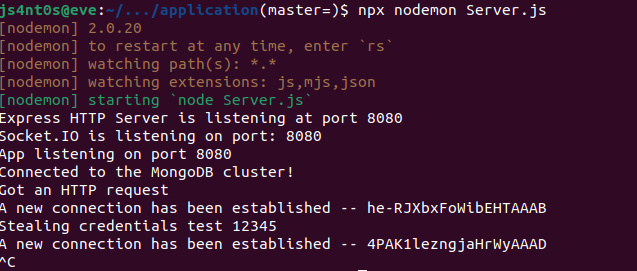
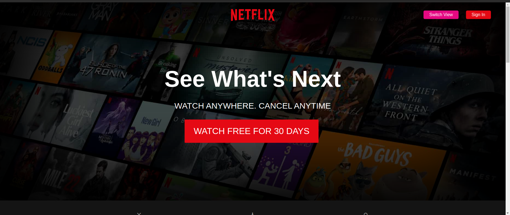
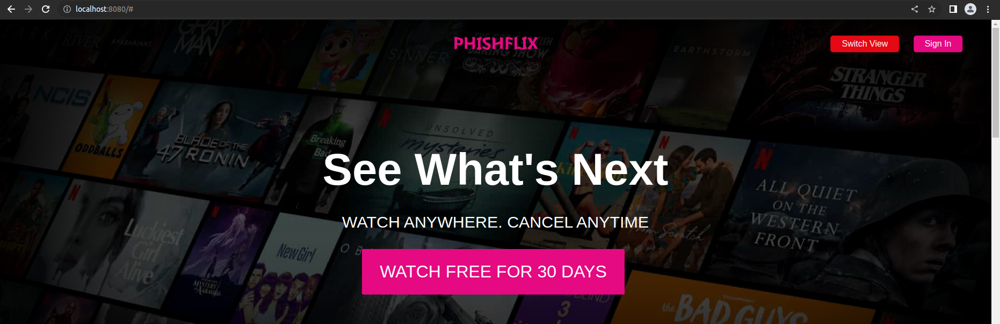
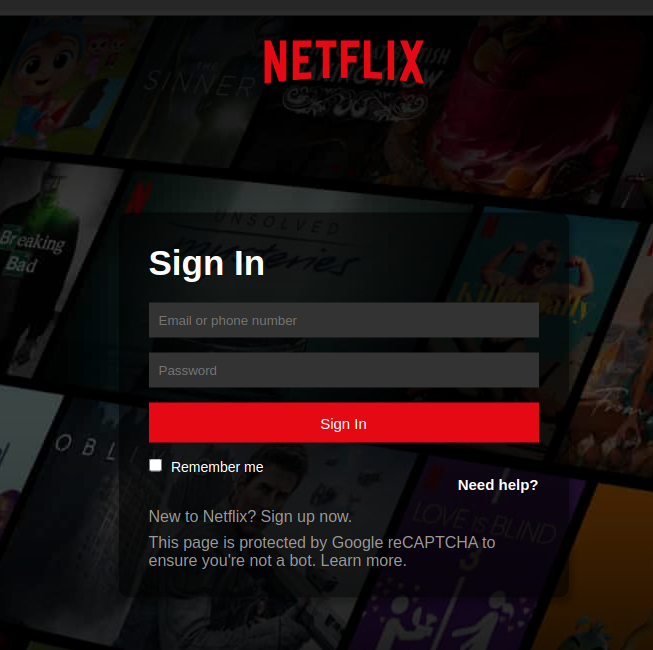
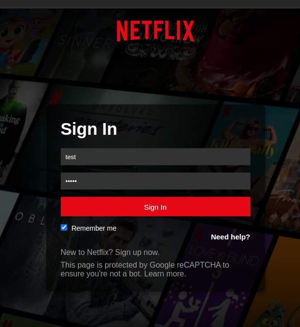
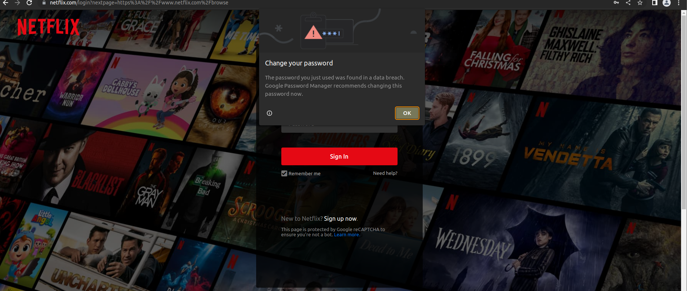
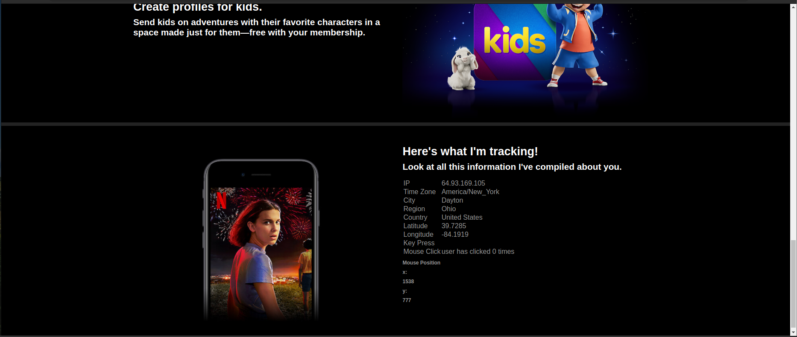

# Course and Instructor information

CPS 471 Dr. Phu Phung SS-LBS

## Developing a Pharming Web Application In Order to Study Its Capabilities, and how it can mimic a real website - Project PhishFlix 

## Team members

    * Jorge L. Santos - santosmendezj1@udayton.edu
    * Aaron Tilton - tiltona1@udayton.edu
    * Ignacio Abrams - abramsi1@udayton.edu

## Links and Repo

- heroku app: https://phishflix.herokuapp.com/#
- bitbucket repo: https://bitbucket.org/ss-lbs-f22-team17/coyote/src/master
- commit history: https://bitbucket.org/ss-lbs-f22-team17/coyote/commits/

## Project Summary 
In our daily lives we often use the same websites without putting too much thought into it. Either browsing Facebook, visiting YouTube, or logging into Netflix, a lot of users have a routine they follow.  Malicious actors can exploit these routines to retrieve valuable data, and private information on unsuspecting users using Pharming. Pharming is the practice of creating deceiving web applications to trick unsuspecting users into sharing private information or downloading malicious software. These “pharm” sites are often made to mimic real websites. On this project we explored how these types of applications are made, and how much information we can gather on the user, we also explore what techniques the user can use to detect the security on when browsing the web. To demonstrate this, we created our own pharming website and discovered ways to steal users information. 
## Introduction 

- Problem:
One of the most common ways people are hacked is due to pharming websites or phishing emails that trick the user into clicking. Once the user clicks on the link malware is then installed into that computers system or a hacker could steal the credentials of the user. That being said we decided to create our pharming website that resembled Netflix in order to demonstrate how easy and common it is for a user to be tricked simply by browsing or clicking a suspicious link.

- Motivation:
Because most of us are so used to constantly browsing on websites such as Netflix, YouTube, or even Twitter; we decided to simulate a pharming attack to understand and demonstrate how easy it is for users to fall for these type of pharming websites that may look almost identitcal to the ones we are so used to seeing.

- Work:
Our work consisted of five parts. Part 1: Research on pharming websites and how they are used to trick people into getting hacked. Part 2: We then started creating a website that mimics Netflix and called it Phisflix. Part 3: After creating the appliaction and interface of the website, we created a payload that notifies the user is about to be hacked/attacked. Part 4: We then realized that we could integrate a database so that the credentials are transmitted to the server whenever the user tries to log in. Part 5: Once the user clicks the login button, the user is redirected to the actual Netflix login page.

- Results:
We created a fully functional pharming website that looks almost identical to the login page of Netflix. Once user tries to login an alert is displayed saying that the user has been hacked and is redirected to the actual login page of Netflix. Since we are simulating as if we were a hacker, we can then steal the credentials the user typed in by accessing the database. Also, we implemented a keylogger and ip-api that gets the users IP address. 

## Background 
As mentioned before, one of the most common ways people get hacked is because of pharming websites or phising emails. Pharming websites are used for deceiving websites and tricking users into sharing private information or even downloading malware. This is the main reason that motivated us to tackle this problem and demonstrate how easy it it for an innocent user to fall for these tricky websites. We created PhishFlix as a pharming website resembling the Netflix login page that when a user tries to login, the user gets an alert saying that he/she has been hacked. Then the user is redirected to the actual login page of Netflx so that the user does not suspect that he/she has been hacked. Unfortunately, we were not able to create a benevolent malware with the time we had but instead the alert message was a demo to demonstrate that malware can be installed into ones computer simply by the click of button. Overall, we did not get the results we were expecting but were satisfied with being able to demonstrate the main problem which was to show how easy it is for typical users to get tricked through pharming websites.
## Project Description 

### Project Overview
As established before, PhishFlix is meant to be a demonstration to show the capabilities of many of these Pharming sites. It has a lot of features such as IP and location tracking, a keylogger, login credentials stealer, and a mock virus to show how users can download material on the site. The purpose is to showcase how these mock sites can fool anybody, not just inexperienced users, but also seasoned individuals that use the internet on a daily basis. 

### Project Goals and Objectives:
There are four main project goals and objective the team wanted to achieve:
1.	Create a Demonstration Site that mimics a real popular site, we chose Netflix
2.	Create a database that stores users’ credentials
3.	Locate where the user has entered the site from
4.	Track user’s activity on the site
5.	Educate and demonstrate users on the dangers of these types of sites, and why verifying where you input information is important
### Phases of Work:
The work was divided into five phases:
- **First Part:** Create a Website that mimics another site that is frequently sed, in our example we are using Netflix, or Phishflix
- **Second Part:** Create an application that functions as an interface in order to trick the user into going through installing the benelovent malware
- **Third Part:** Add functionalities to the site such as location tracking and a database to collect user’s login credentials
- **Fourth Part:** Package everything together, debug, and refactor code that needs to be fixed. (Maintain the program).
- **Fifth Part:** Create a report.

### Metrics for Evaluation:
A work like this won’t ever be fully complete. The team can always create and polish the application more until it is indistinguishable from the actual site it is trying to mimic. For this scope however, accomplishing the main project goals would be more than enough, and would serve as an example on how these projects are developed. It will also teach the others what to watch out for, while we are developing the project.

### Implementation:
#### Running it on your machine:
To run the code on your machine, you must first have Node.js installed on it. Our team works on Linux, so using the command npm install node should start downloading the node.js. It also uses express, socket.io and mongodb, so to run the site appropriately you must install those dependencies. To ease the use of the site, it has been deployed to Heroku, so you can visit the site through your web browser. It is notable that the IP tracker does not work on Heroku, due to it somehow hiding the visitor’s ip address. 

#### User Interface:
The first aspect of our site is the User Interface, it is modeled off Netflix’s UI, it features a “WATCH MOVIES AND TV FOR FREE” to capture your attention and serves as the main hook for the web application. Scrolling down, it will just mimic and advertise itself to appear as legitimate as possible to the user, but in the end, we allow the user to see a sneak peek onto what they are being tracked. On top there’s two buttons, a switch view button, which switches it to PhishFlix version of the site that becomes more obvious that’s not the real Netflix, and a Sign In button that will popup a form to fill your credentials. The User Interface was largely gathered through online resources and visiting the actual webpage to mimic it. Images were taken directly from Netflix’s site.  You can observe the code on both the index.html and CSS files (which is in public/css/style.css)

####  Database:
The Sign In button is linked with the database, and this is what it allows to capture the user’s information. You can find the code for inserting user information on serverdb.js, which is connected to the backend in server.js (retrieves the code from the frontend), and index.html contains the script that collects the information from the input.

#### Location and IP Tracking:
The location and IP tracking is done by using ip-api. Using this, it collects the user’s information and converts it into JSON objects, which can then be easily transported and called on the program. The user’s location, city, region and machine ip address is all presented n the bottom, but again Heroku masks the user’s ip so it doesn’t work when deployed, but running it on your local machine does show it. Pictures will be provided below. 	

#### Mouse and Keypress Events:
There are two main events, mouse position that can track where the user’s cursor is. This can be useful especially for data mining and determining how long a user stays in the bounds of an area. The second one is key press event, which can be easily connected to a text file, and function as a keylogger within the website. 

## Results 

The project was a huge undertaking from the start. Frankly I will say the results were not what we expected since the team had a lot of work during the semester. There’s a lot more that we could have done for the project, but the team is proud to say that we did manage to create a great framework / application to build off. All the main components are available, and using more tools such as google analytics, and actual viruses would be a great component to add onto the application.

The main point of the project was to show us how easily it is to steal user’s information, and I believe the team achieved this. Using various tools, we were able to create an application that does collect a lot of information without any user input, and from what we have seen from other alumni is that they think we are showing them a legitimate application. As stated, before there’s a lot more that can be added onto it, to showcase how insidious these real applications can be. Things such as a code obfuscator will be something really cool to implement for an update.

The team’s contributions were:
-	**Jorge:** CSS, Front-end and Location development
-	**Aaron:** Backend and Database development
-	**Ignacio:** Backend and Malware development

## Appendix 

This is a presentation of the project:

To run the application we used npx nodemon which autorestarts the application whenever it detects a change, other commands that work are Node Server.js or npm start. Alternatively you can use the heroku app https://phishflix.herokuapp.com/#

Once the user enters the site they will be greeted with a webpage that mimics Netflix, we chose netflix because it is a very popular streaming service with a CSS relatively easy to recreate. 

By clicking switch view, you can see how the webpage transforms to our original design which is a more easily identefiable webpage.

The Sign in form is modeled after netflixs actual sign in page, and it provides inputs so the user can input their login credentials. Anything you fill will be redirected to the database hosted on mongodb.

After clicking sign in, it will redirect the user to netflix's actual sign in page. Something cool to implement would be adding "an error occured" alert that will then redirect you to the home page.

On the bottom of the page it provides all the tracking information gathered by the site. Here you can see my VM's ip address, the exact location and whatever I am doing actively on the page.

